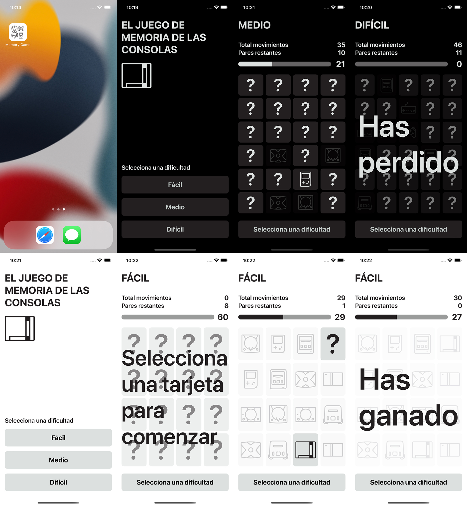

# Memory Game
#### Propuesta de resolución del reto de programación mensual publicado por Rviewer x MoureDev (Mayo 2022)
> ##### Tienes toda la información en [https://go.rviewer.io/dev-memory-game-es/](https://go.rviewer.io/dev-memory-game-es/)

## Información general

**App iOS creada utilizando Swift y SwiftUI con MVVM.**

* iOS 15+
* Swift 5+
* Xcode 13+
* Idiomas: Español e Inglés
* Soporta modo oscuro

## Estructura del proyecto

* UseCases: View + ViewModel
	* App: Contexto inicial
	* Menu: Menú de opciones
	* Board: Tablero de juego
	* Views: Vistas comunes
* Model: Modelos
* Util: Utilidades
* SupportingFiles: Ficheros de internacionalización
* Assets: Recursos gráficos
* Tests: Test de lógica
* UITests: Test de vista

## Vídeo

Una vez resuelvas el reto podrás acceder a un vídeo en el que te explico cómo he afrontado mi solución.

> ##### Cada mes un nuevo reto en [https://github.com/mouredev/Monthly-App-Challenge-2022](https://github.com/mouredev/Monthly-App-Challenge-2022)

##  Hola, mi nombre es Brais Moure.
### Freelance full-stack iOS & Android engineer

Soy ingeniero de software desde hace más de 12 años. Desde hace 3 años combino mi trabajo desarrollando Apps con creación de contenido formativo sobre programación y tecnología en diferentes redes sociales como **[@mouredev](https://moure.dev)**.

### En mi perfil de GitHub tienes más información

